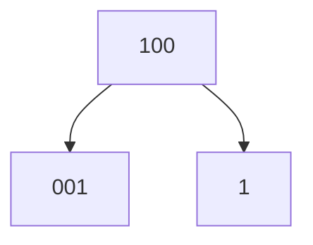

# While Loop

```cpp
#include <bits/stdc++.h>
using namespace std;
int main()
{
    int cal = 0;
    while (cal < 10)
    {
        cout << "Runnung a step and burning " << cal + 1 << endl;
        cal = cal + 1;
    }

    cout << "Out of loop" << endl;
    cout << cal << endl;
    return 0;
}
```

# While Example - Sum of N Inputs

```cpp
#include <bits/stdc++.h>
using namespace std;
int main()
{
    int N;
    cin >> N;

    int i = 0;
    int sum = 0;
    int temp;

    while (i < N)
    {
        cin >> temp;
        sum += temp;
        i++;
    }

    cout << sum << endl;
    return 0;
}
```

# For Loop

```cpp
#include <bits/stdc++.h>
using namespace std;
int main()
{
    int cal;
    for (cal = 0; cal < 10; cal++)
    {
        cout << "Running a step and burning" << cal + 1 << endl;
    }

    cout << "Out of the loop" << endl;
    cout << cal << endl;

    return 0;
}
```

# For - While Equivalence

```cpp
#include <bits/stdc++.h>
using namespace std;
int main()
{
    int cal = 0;
    for (; cal < 10;) // Similar to While Loop
    {
        cout << "Running a step and burning" << cal + 1 << endl;
        cal++;
    }

    cout << "Out of the loop" << endl;
    cout << cal << endl;

    return 0;
}
```

# Problem - Sum of Digits of a Number

+ Using `while` loop
```cpp
#include <bits/stdc++.h>
using namespace std;
int main()
{
    int N;
    cin >> N;

    int sum = 0;
    while (N != 0)
    {
        int last_digit = N % 10;
        sum = sum + last_digit;

        N /= 10;
    }
    cout << sum << endl;
    return 0;
}
```

+ Using `for` loop
```cpp
#include <bits/stdc++.h>
using namespace std;
int main()
{
    int N;
    cin >> N;

    int sum = 0;
    for (; N != 0; N /= 10)
    {
        sum = sum + N % 10;
    }
    cout << sum << endl;
    return 0;
}
```

# Problem - Star Pattern

```bash
# N = 5

    *
   ***
  *****
 *******
*********
```

```cpp
#include <bits/stdc++.h>
using namespace std;
int main()
{
    int n;
    cin >> n;

    for (int i = 1; i <= n; i++)
    {
        for (int spaces = 1; spaces <= n - i; spaces++)
        {
            cout << " ";
        }
        for (int stars = 1; stars <= 2 * i - 1; stars++)
        {
            cout << "*";
        }
        cout << endl;
    }
    return 0;
}
```

# Problem - For ABCD Pattern

```bash
# N = 5

ABCDEEDCBA
ABCDDCBA
ABCCBA
ABBA
AA
```

```cpp
#include <bits/stdc++.h>
using namespace std;
int main()
{
    int n;
    cin >> n;

    for (int i = 1; i <= n; i++)
    {
        char letter = 'A';
        // letters n - i + 1 letters in int values
        for (int cnt = 1; cnt <= n - i + 1; cnt++)
        {
            cout << letter;
            letter++;
        }i

        letter -= 1;

        // letters n - i + 1 letters in dec values
        for (int cnt = 1; cnt <= n - i + 1; cnt++)
        {
            cout << letter;
            letter--;
        }
        cout << endl;
    }
    return 0;
}
```

# Problem - Print Reverse of a Number

+ Here, we have two approaches for output

+ For output like `001`

```cpp
#include <bits/stdc++.h>
using namespace std;
int main()
{
    int n;
    cin >> n;

    while (n > 0)
    {
        int last_digit = n % 10;
        cout << last_digit;
        n /= 10;
    }
    return 0;
}
```

# Problem - Reverse the Actual Number

+ For output like `1`

```cpp
#include <bits/stdc++.h>
using namespace std;
int main()
{
    int n;
    cin >> n;

    int answer = 0;
    while (n > 0)
    {
        answer = answer * 10 + (n % 10);
        n /= 10;
    }
    cout << answer << endl;
    return 0;
}
```

# Break

```cpp
#include <bits/stdc++.h>
using namespace std;
int main()
{
    int calories = 0;
    int gf_calls_up = 10;
    while (calories < 30)
    {
        cout << "Running & Burning calories " << calories + 1 << endl;
        if (calories == gf_calls_up)
        {
            break;
        }
        calories++;
    }
    cout << "Out of the loopi" << endl;
    return 0;
}
```

# Continue

```cpp
#include <bits/stdc++.h>
using namespace std;
int main()
{
    int calories = 0;
    while (calories <= 30)
    {
        if (calories % 5 == 0)
        {
            cout << "Well done" << endl;
            calories++;
            continue;
        }

        cout << "Running & Burning calories " << calories << endl;
        calories++;
    }
    cout << "Out of the loop" << endl;
    return 0;
}
```

# Problem - Prime Number Check

```cpp
#include <bits/stdc++.h>
using namespace std;
int main()
{
    int n, i;
    cin >> n;

    for (i = 2; i <= n - 1; i++)
    {
        if (n % i == 0)
        {
            cout << n << " is Not Prime" << endl;
            break;
        }
    }

    if (i == n)
    {
        cout << n << " is Prime" << endl;
    }
    return 0;
}
```

# Do While

> Exit control loop. It is executed at least once irrespective of conditions.

```cpp
#include <bits/stdc++.h>
using namespace std;
int main()
{
    int money = 5;
    do
    {
        cout << "Shopping and money left " << money << endl;
        money--;
    } while (money > 0);
    return 0;
}
```

# Nested Loops

```bash
# R = 4, C = 5

1 2 3 4 5 
6 7 8 9 10 
11 12 13 14 15 
16 17 18 19 20 
```

```cpp
#include <bits/stdc++.h>
using namespace std;
int main()
{
    int R, C;
    cin >> R >> C;

    int val = 1;

    for (int i = 0; i < R; i++)
    {
        for (int j = 0; j < C; j++)
        {
            cout << val << " ";
            val++;
        }
        cout << endl;
    }
    return 0;
}
```

# Problem - Number Pyramid

```bash
# N = 5

    1
   232
  34543
 4567654
567898765
```

```cpp
#include <bits/stdc++.h>
using namespace std;
int main()
{
    int n;
    cin >> n;

    for (int i = 1; i <= n; i++)
    {
        // Spaces
        for (int cnt = 1; cnt <= n - i; cnt++)
            cout << " ";

        // Increment Number
        int val = i;
        for (int cnt = 1; cnt <= i; cnt++)
        {
            cout << val;
            val++;
        }

        // Decrement Number
        val = val - 2;
        for (int cnt = 1; cnt <= i - 1; cnt++)
        {
            cout << val;
            val--;
        }
        cout << endl;
    }
    return 0;
}
```


---

Next Section ⇾
[[09 Functions]]