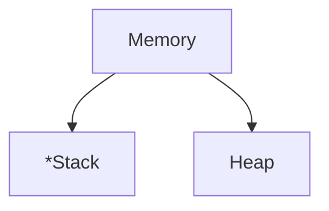

# Introduction to Functions

A function is a block of instructions which only execute when it is called.

```cpp
#include <bits/stdc++.h>
using namespace std;

void play_music()
{
    cout << "Playing Music";
}

int main()
{
    play_music(); // Function call
    return 0;
}
```

+ Function Definition

```cpp
returnType function_name (parameters if any)
{
	// Bunch of instructions

	// Return value (optional)
}
```

+ Function call 
To call a function, write the function's name followed by two parentheses ( ) and a semicolon `;`

```cpp
// Function Definition
void play_music()
{
	cout << "Playing Music";
}

int main()
{
	// Function Call
	play_music();

	return 0;
}
```

+ Parameters
You can pass data, known as **parameters**, into a function.

```cpp
void play_music(int n)
{
	cout << "Playing Music" << n;
}

int main()
{

	play_music(5);
	return 0;
}
```

Parameters act as variables inside the function. You can add as many parameters as you want, just separate them with a comma.

```cpp
void play_music(int song1, int song2, int song3)
{
	cout << "Playing Music" << song1 << song2 << song3;
}

int main()
{

	play_music(5,6,7);
	return 0;
}
```

# Functions Code Demo

```cpp
#include<iostream>
using namespace std;

void playMusic(){
	cout <<"Playing Music"<<endl;
}

void sayHi(string name){
	cout <<"Hi " + name <<endl;
}

string sayHello(string name){
	return "Hello " + name;
}

int areaOfCircle(int radius){
	return 3.14 * radius * radius;
}


int main(){

	playMusic();
	sayHi("Ram");
	sayHi("Shyam");
	cout << sayHello("Coding Minutes ") <<endl;
	cout << sayHello("Learners") <<endl;

	int area = areaOfCircle(5);
	if(area>10){
		cout <<"We can cut the land" << area<<endl;;
	}


	return 0;
}
```

# Default Parameters

```cpp
#include <bits/stdc++.h>
using namespace std;

void vivaNumber(int rollCall1 = 1, int rollCall2 = 2)
{
    cout << "Roll Call: " << rollCall1 << ", " << rollCall2 << endl;
}

int main()
{
    // Without giving any parameter
    vivaNumber();

    // Giving one parameter
    vivaNumber(101);

    // Giving two parameter
    vivaNumber(101, 102);

    return 0;
}
```

# Forward Declaration

A C++ function consists of two parts
+ Declaration: The function's name, return type, and parameters (if any).
+ Definition: The body of the function (code to be executed)
+ Function Call: Function must be called, in order to execute the code of the function. Function can be called one or more times.

> Function must be declared before it is called.

```cpp
#include <bits/stdc++.h>
using namespace std;

// Forwarded Declaration
void playMusic();

int main()
{
    // Function Call
    playMusic();
    return 0;
}

// Declaration + Definition
void playMusic()
{
    cout << "Playing Music" << endl;
}
```

# Problem - Find Factorial

```cpp
#include <bits/stdc++.h>
using namespace std;

int fact(int n)
{
    int result = 1;
    for (int i = n; n > 0; n--)
    {
        result = result * n;
    }
    return result;
}

int main()
{
    int n;
    cin >> n;

    cout << fact(n) << endl;
    return 0;
}
```

# Problem - Find Binomial Coefficient

```cpp
#include <bits/stdc++.h>
using namespace std;

int fact(int n)
{
    int res = 1;
    for (int i = n; i > 0; i--)
    {
        res *= i;
    }
    return res;
}

float bino(int n, int r)
{
    return fact(n) / (fact(r) * fact(n - r));
}

int main()
{
    cout << "Enter the value N and R" << endl;

    int n, r;
    cin >> n >> r;

    cout << "The result is " << bino(n, r) << endl;

    return 0;
}
```

# Call Stack


+ Every time a function is called, it gets created in the stack memory.
+ All the local variables belonging to that function are part of the stack frame.
+ Once the function call, the stack frame is cleared off.
+ The function that is currently is always at the top of the stack.


# Problem - Check Prime (Root N Optimisation)

```cpp
int checkPrime(int n)
{
	int i = 2
	while i < n
	{
		if (n % i == 0)
		{
		return False
		}
	}
	return True
}
```

# Problem - Binary to Decimal

```cpp
#include <bits/stdc++.h>
using namespace std;

int binary2decimal(int n)
{
    int p = 1;
    int ans = 0;

    while (n > 0)
    {
        int last_digit = n % 10;
        ans += last_digit * p;
        p *= 2;
        n /= 10;
    }
    return ans;
}

int main()
{
    int n;
    cin >> n;
    cout << binary2decimal(n) << endl;
    return 0;
}
```

# Problem - Decimal to Binary

```cpp
#include <bits/stdc++.h>
using namespace std;

int decimal2binary(int n)
{
    int p = 1;
    int ans = 0;

    while (n > 0)
    {
        int rem = n % 2;
        ans += rem * p;
        p *= 10;
        n /= 2;
    }
    return ans;
}

int main()
{
    int n;
    cin >> n;
    cout << decimal2binary(n) << endl;
    return 0;
}
```

---

Next Section ⇾
[[10 Pointers]]