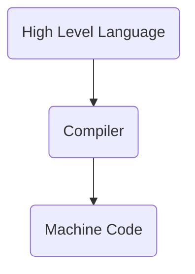

# Variables

+ **Variable Name**: A label for a memory location
+ **Value**: The something that would be stored in a variable
+ **Storage**: A place where data can be stored (`RAM`)
+ **Declaration**: Announcing a variable (usually) at the beginning of a program
+ **Naming convention**: A set of rules about the names of variables
+ **Assignment**: Giving (setting) a variable a value

##### Naming Variable

+ For variable name we can use uppercase and lowercase letters, digits from 1 to 9 and underscore `_`.
+ First character must be underscore or letter.
+ C++ is a strongly typed language. So every variable needs to be declared before using it.

```cpp
// Valid Names
double simple_interest;
int student_age;
float student_precentile;
char ram_214;

// Invalid Names
int 123_age;
```

##### Initialization

+ Variables when just declared have garbage value until they are assigned a value for the first time.
+ We can assign a specific value from the moment variable is declared, called as **initialization of variable**.

```cpp
// Initialisation of variable
float a = 10;

// Declaration
int ram;

// Assignment
ram = 214;
```

# Data-types

Primitive Data-types

| Name                  | Keyword | Size    |
| --------------------- | ------- | ------- |
| Boolean               | bool    | 1 byte  |
| Character             | char    | 1 byte  |
| Integer               | int     | 4 bytes |
| Floating Point        | float   | 4 bytes |
| Double Floating Point | double  | 8 bytes |

**Code:**

```cpp
#include <iostream>
#include <iomanip>
using namespace std;
int main()
{
    bool x = true;
    bool isWeatherRainy = false;

    cout << x << endl;
    cout << isWeatherRainy << endl;

    int y = 5128;

    float pi = 3.1415926535;
    double pi_d = 3.1415926535;

    cout << y << endl;
    cout << setprecision(10) << pi << endl;
    cout << setprecision(10) << pi_d << endl;

    char letter = 'A';
    char dollar = '$';

    cout << letter << endl;
    cout << dollar << endl;

    return 0;
}
```

Output:
```bash
1
0
5128
3.141592741
3.141592654
A
$
```

# Using sizeOf Operator

```cpp
#include <iostream>
using namespace std;
int main()
{
    int x;
    cout << sizeof(x) << endl;
    cout << sizeof(int) << endl;

    cout << "Char: " << sizeof(char) << endl;
    cout << "Bool: " << sizeof(bool) << endl;
    cout << "Float: " << sizeof(float) << endl;
    cout << "Double: " << sizeof(double) << endl;

    return 0;
}
```

# Binary Number System



# Storage of Integers


# Data type Modifiers

Several of the basic types can be modified using one or more of these type modifiers:

```cpp
signed
unsigned
short
long
```

For example-
```cpp
int marks;
unsigned int roll_number;
unsigned long long int large_fact;
short int age;
```

##### Size of type modifiers
```cpp
#include <iostream>
using namespace std;
int main()
{

    cout << "int:" << sizeof(int) << endl;
    cout << "Short int: " << sizeof(short int) << endl;
    cout << "Long int: " << sizeof(long int) << endl;
    cout << "Long long int: " << sizeof(long long int) << endl;

    return 0;
}
```

# Storage of Negatives Numbers


# Range of Signed vs Unsigned Integers


# Storage of Floats & Doubles


# Storage of Characters


```cpp
#include <iostream>
using namespace std;
int main()
{
    char ram = 'R';
    int heyyRam = ram;

    cout << ram << endl;
    cout << heyyRam << endl;
    return 0;
}
```


# Storage of Boolean


```cpp
#include <iostream>
using namespace std;
int main()
{
    bool something = 5; // non-zero is treated as true
    cout << something << endl;
    return 0;
}
```

# Constants


```cpp
#include <iostream>
#define NAME "RAM" // It is replacement text
#define PI 3.1415 // It is replacement text
#define ll long long

using namespace std;
int main()
{
    const long long ram = 214; // bucket
    cout << PI * ram << endl;
    cout << NAME << endl;
    return 0;
}
```


---

Next Section ⇾
[[06 Operators & Expressions]]