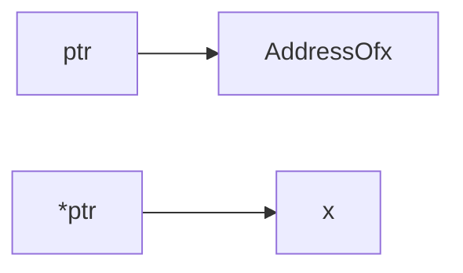
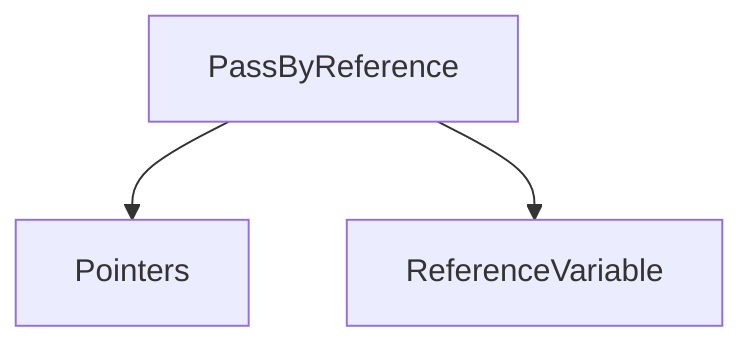

# Address Of Operator

Previously, we use `&` in bit-wise operator. Now we use `&` to find the address of a variable which is stored in the memory.

> Pointer is a variable which holds the address of another variable.

```cpp
#include <bits/stdc++.h>

using namespace std;

  

int main()

{

    int x = 10;

    cout << "x = " << x << endl;

    cout << "Address of x = " << &x << endl;

  

    float y = 2.14;

    cout << "y = " << y << endl;

    cout << "Address of y = " << &y << endl;

    return 0;

}
```

The address is visible in the hexadecimal number system like- `0x61ff08`
+ To store address of any variable, we use a special type of variable called `pointer variable`.

```cpp
#include <bits/stdc++.h>

using namespace std;

  

int main()

{

    int x = 10;

    cout << "x = " << x << endl;

    cout << "Address of x = " << &x << endl;

  

    int *p = &x;

    cout << "Address of x using pointer variable = " << p << endl;

  

    return 0;

}
```

# Pointer Variables

+ Valid Syntax for pointer variable
```cpp
#include <bits/stdc++.h>

using namespace std;

  

int main()

{

    int x = 10;

    cout << "x = " << x << endl;

  

//  Valid syntax

    int *px = &x;

    int *py = &x;

    int *pz = &x;

  

    cout << "px = " << px << endl;

    cout << "py = " << py << endl;

    cout << "pz = " << pz << endl;

  

    return 0;

}
```

+ Pointer for different types of variables

```cpp
#include <bits/stdc++.h>

using namespace std;

  

int main()

{

    int x = 10;

    long int y = 'R';

    float z = 10.5;

  

    int *px = &x;

    long int *py = &y;

    float *pz = &z;

  

    cout << px << endl;

    cout << py << endl;

    cout << pz << endl;

    return 0;

}
```

+ Create pointer to a pointer

```cpp
#include <bits/stdc++.h>

using namespace std;

  

int main()

{

    int x = 10;

    int *px = &x;

    int **ppx = &px;

  

    cout << "x = " << &x << endl;

    cout << "px = " << px << endl;

    cout << "ppx = " << ppx << endl;

    return 0;

}
```

# Dereference Operator

+ An interesting property of pointer is that they can be used to access the variable they point to directly. This is done by preceding the pointer name with the dereference operator `*` . The operator itself can be read as "value pointed to by".



```cpp
#include <bits/stdc++.h>

using namespace std;

  

int main()

{

    int x = 10;

    int *ptr = &x;

  

    // Address of x OR Pointer
    cout << "ptr x: " << ptr << endl;

  

    // Value of x OR Dereference

    cout << "*ptr x: " << *ptr << endl;

    return 0;

}
```

+ Null Pointer
Sometimes it is useful to make our pointers point to nothing. This is called a null pointer.

```cpp
#include <bits/stdc++.h>

using namespace std;

  

int main()

{

    int *p = 0;

    int *q = NULL;

  

    cout << p << endl;

    cout << q << endl;

    return 0;

}
```

> We can't dereference the NULL pointer.

# Pass by References - using Pointers

Let's understand this by an example:
Suppose we have a variable `views` in main function, and we pass that variable into a function called `watchVideo`. This function should return the incremented value of `views`, but it returns the original value of `views`.
This is happening because of local variable. `watchVideo` function consider `views` as its local variable and won't update the changes in the `views` of main function.
In this type of cases, we use `Pass by reference` using pointer by which our variable can be easily updated and reflect the change in `main` function.
For this, we have to pass address of the variable in the calling function, and create a pointer attribute and use it in the function.

```cpp
#include <bits/stdc++.h>
using namespace std;

void watchVideo(int *viewsPtr)
{
	*viewsPtr = *viewsPtr + 1;
}

int main()
{
	int views = 100;
	watchVideo(&views);
	cout << views << endl;
	return 0;
}
```

# Reference Variables
We can pass objects by two types:

So, here we come with the pass by reference using the `reference variable`. In this situation, we allocate the address of the reference variable to another variable, and both points to the same block of memory. Changes in one will be reflected in other(s). Reference Variable can't be initialized without any value. For example: `int &thisIsReferenceVar;`
These are initialized like this: `int &thisIsReferenceVar = otherVariable;`
```cpp
#include <bits/stdc++.h>
using namespace std;

int main()
{
	int x = 10;
	int &y = x;

	y++;

	cout << x << endl;
	cout << y << endl;
	return 0;
}
```

> PS: Pass by pointer is explained in the above heading. 

# Pass by Reference - Reference Variables

```cpp
#include <bits/stdc++.h>
using namespace std;

void applyTax(int &income)
{
	float tax = 0.10;
	income = income - income * tax;
}

int main()
{
	int income;
	cin >> income;

	applyTax(income);
	cout << income << endl;
	return 0;
}
```
In the above code, the scope of `&income` variable lasts till the function is executing. As it is a reference variable, the modified value will be reflected in the `main` function.


---

Next Section ⇾
[[11 Arrays]]